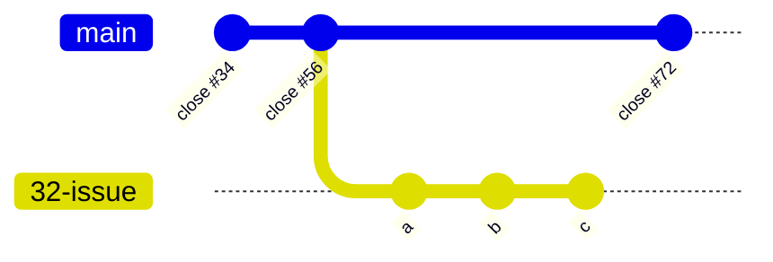
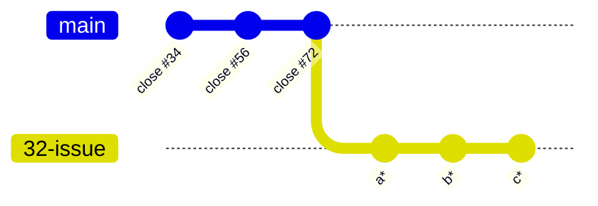
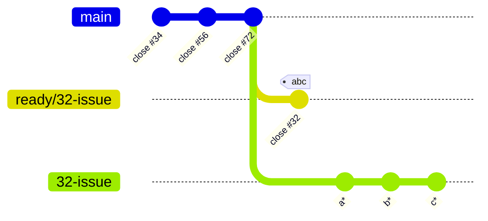
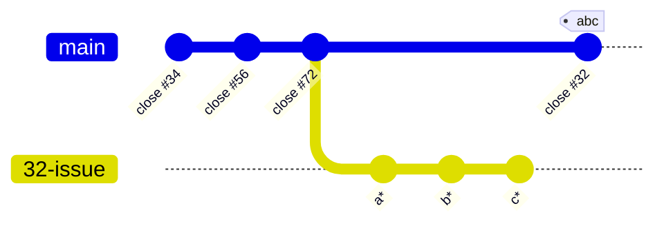
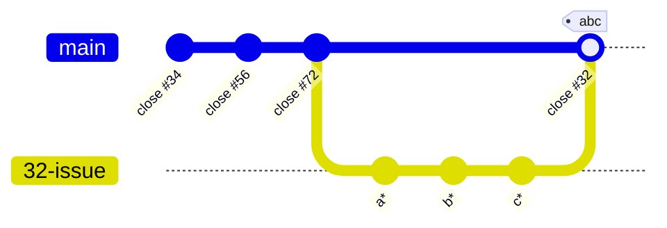

Considering the fact that Git itself is a superior version control system and GitHub is a platform that uses Git intensely. It's a bit of a mystery how poorly GitHub managed to implement Pull Requests (PRs)
{: .kicker}

<!-- cspell:ignore Gitea  Gerrit  -->
Pay attention to the fact that a _PR_ is not a core Git concept, but an _interpretation_ of an original Open Source community collaboration model (GitLab, BitBucket, Azure DevOps, Gitea, Gerrit all implement their own _slightly different_ interpretations of the concept).

## What is it good for - originally?

In a nutshell: Open source means that the source is open and _readable_ to everyone. But it very seldom means that everyone can _write_ – commit – to such a repo. Only trusted contributors have write access to an Open Source repo. So if you're an _outsider_ and want to contribute to a repo where you can read, but not write the process is as follows:

1. Create a `fork` - this is your own repo - now you (and your colleagues) have write access. Not to _the_ repo but to _a_ repo with the source code.
2. Make you desired changes in your own fork.
3. Since you can not _push_ to the original repo, what you do instead is that you request a _pull_ from the benevolent dictator or one of the trusted lieutenants of the repo. Originally this _pull request_ is not the PR concept as implemented in GitHub, but simply an email or a message on the community IRC.
4. The construct of the fork means that they the trusted contributors in the original repo can bring the branch in your own fork into their repo, an if they like your contribution they can merge it into `main`.

## What is it good for - in GitHub?

In GitHub a pull request is designed around the (assumed) need for `code reviews`. And although GitHub's PR do support working with forks too, 100% of all PR implementations I've ever seen in GitHub works within _the same_ repo. Often with a ruleset or policy around it, that makes it _behave_ almost like a fork:

- You don't have write access to `main`
- Peer reviews are required before the PR is merged in
- Tests and statuses (often automated in declarative workflows) are required

Under the hood; In essence a Pull Request in GitHub is implemented as a variant of a Github Issue

### So what's the problem - in GitHub?

Before we dive into the problems, I'd like to set the scene for how we work in our team: We work with a trunk-based approach, we work in small commits, we commit to `main` often  and we keep `main` in an always-shippable mode. Formulated as policies it reds like:

1. We work with a kanban approach. We design our GitHub issues so that each match a commit onto main (one issue becomes one commit).
2. We attach a development branch to each issue.
3. We keep our work-log and comments to design decisions on our issues.
4. We require our history on main to be strictly linear and we want our merges onto main to be `fast-forward-only` so that the commit that is verified in the process is the _exact same_ (same SHA) as the one that ends up on `main`.
5. `main` must be kept pristine (all commits on `main` are potentially _shippable_ no intermediate commits are allowed) ...consequently
6. A development branch can only contain _one_ commit. This implies that contributors must prepare (rebase and collapse) their branch for delivery to even enable a `fast-forward` (we've automated the process though).
7. We do not _consistently require_ a peer review on our code before it's merged to main, instead we run extensive automated tests and static code analysis in our `pre-deliver.yml` workflow which sets various statuses that must be successful for the development branch to be _mergable_ onto `main`.
8. We do _occasionally require reviews_. We do this through the use the `CODEOWNERS` file which allows us to enforce a review when a commit includes files that are _owned_ by someone.

So what are the problems? Well, there's quite a handful:

#### The review - requires Pull Requests

In GitHub the concept of a _review_ is embedded into the concept of a _Pull Request_ and although annotated comments to commits are supported there isn't an formal way to approve|disapprove a commit - except when the reviews are implemented inside the PRs

#### The `CODEOWNER` file - requires Pull Requests

Although a brilliant concepts, the `CODEOWNER` file is only used, read and it's ownership enforced in the Pull Request process

#### The issue are eclipsed – by the pull request

When we work on issues, we'd like the comments related to the code developed in contest of that issue, but GitHub creates as Pull Request (another issue) on top of the original issue, so now we have two logically identical issues - they both relate to the same development branch. Any review comments are now done in context of the Pull Request, whereas design decisions and work logs in general are done in context of the original issue.

#### Pull Requests don't support true linear (`fast-forward`) history

It's a git technical discussion, but it's well summed up in this [Feature request discussion on GitHub](https://github.com/orgs/community/discussions/4618) I'll illustrate the desired concept like this:



**Situation:** I've started working on issue 34. Now I'm done and I'd like to deliver to `main` but in the meantime `main` is updated with stuff I haven't seen on my branch yet — and my issue branch contains three commits.

**non-compliant:** In this state I can not deliver; merge wouldn't be `fast-forward` and my branch contains more than one commit, so even If I rebased to `main` my _intermediate_ commits `a` and `b` commits would void the _pristine-ness_. of `main`

First thing is a rebase:



Technically this will rewrite history - my `a`, `b` and `c` commits will be given new SHAs but at this point – on my own dev branch – I don't care about the SHAs. They are not important — _yet_.

Next I will collapse my branch. I do this by creating a `ready/32-issue` branch on the `32-issue` branch head and then I rebase the new branch onto itself, with the commit on `main`(`close #72`) as base:



At this point, if a run a `diff` on `32-issue` and `ready/32-issue` they are 100% identical - The rebase onto itself is conceptually the same as a _squash merge_ only it doesn't happen in the merge process. But on a separate branch, before the merge.

The `pre-deliver` verification now runs on the `ready/32-issue` branch and if it's successful it will be a single commit, `fast-forward` onto `main`- keeping it pristine. No new commit is created, the `main` HEAD is simply moved to the existing `abc`



The intermediate `ready/32-issue` branch is used instead of just brutally forcing the `32-issue` branch simply because that the commits on the `32-issue` branch may be referenced in the GitHub Issue. And also we don't actually know if we're done yet. The `pre-deliver` verification may fail. in which case I need to do more work. I'd rather do that on my original `32-issue` branch than my _kinda_. arbitrary `ready/32-issue` branch. But say that the merge completes as described in the latest graph. The `32-issue` branch still appears to be in a somewhat unfinished state and deleting it would require a `-D`(as opposed to `-d`) switch indicating that it's not merged.

I can fake the merge relation ship like this:

```shell
git checkout main
git merge -s ours 32-issue
```

To draw this pretty picture:



A GitHub Pull request supports nothing like this (as discussed intensely in the GitHub discussions referenced above).

This looks like `32-issue` was simply squash-merged onto `main` this is something the GitHub Pull request supports.

>_If it walk like a duck and it quacks like a duck..._
>_– Who cares - can't we just call it a duck???_

– No!

In our `pre-deliver` verification process We're setting a lot of status checks and I'd like to record and keep those, and we might even have developers verify their commit with a PGP key. This is common and fundamental practice in configuration management. that the commit you verified is the commit you elevate. Not a _similar_ commit – but _the exact same_ commit.

**The GitHub PR _squash-merge_** just throws all that detail out the window and creates a new commit.

**The GitHub PR _rebase-merge_** achieves logically the same thing -if I careful made sure, that no actual rebase is needed - but it also creates a new commit with a different SHA.

**The GitHub PR _merge_** could apparently be a solution, since a simple merge by default will favor a `fast-forward` if possible. Only not in a GitHub PR context. For some reason the GitHub PR insist on rewriting the commit message - effectively creating a new SHA even in the simple _merge_ strategy.

## Possible solutions

### 1: Suck it up

Go with the GitHub Pull Request's _squash_. merge strategy and live with the undesired side effect imperfect solution.

👎 Pull Request in general violates our policy (3) that we recorded annotations on our issues – PR's will make annotations on the arbitrary parallel _shadow_ issue, the PR itself

👎 The built in merge strategies in PRs all violate our policy (4) that we wish a true linear history (same SHA as was verified goes onto main)

👍 The support for the `CODEOWNERS` file (8) is something we get for free when using PRs

### Short circuit the Pull Request flow

Create a workflow that intercepts with the PR process when all status are met and any potential reviews are approved and manually merges the issue branch onto `main`

```shell
git checkout main 
git merge --ff-only 32-issue
```

As with all PR based solution we will see

👎 Pull Request in general violates our policy (3) that we recorded annotations on our issues – PR's will make annotations on the arbitrary parallel _shadow_ issue, the PR itself

👍 The support for the `CODEOWNERS` file (8) is something we get for free when using PRs

Although we could achieve something close to what we wanted this implies a handful of other disadvantages:

👎 We would have to generate separate PAT (Personal Access Tokens) to get this to work

👎 We would have to open up rules on `main` to be bypassed by the impersonated commit flow

👎 The firing events in the workflow could become tricky

👎 There's now way we can disable _all_ merge strategies on PRs, at least _one_ must be enabled, allowing for human errs. Somebody could push the _merge_ button and ruin what we tried to achieve by the customization.

### Discard the use of PR's all together

👍 This would allow us to enforce that our policy (3) that we recorded annotations on our issues.  PR's would obscure the picture anymore

<!-- cspell:ignore cdown codeowners -->

👎 The support for the `CODEOWNERS` file (8) is something we would have to implement our selves (found two python modules we could explore [python-cdown](https://github.com/andreoliwa/python-cdown){: target="_blank"} and [codeowners](https://github.com/sbdchd/codeowners){: target="_blank"})

👎 The _reviews_. would be conducted as annotated comments to commits - without the PR, we would have to implement an "approved" status ourselves (could be set as a label on the issue, that triggered a workflow)
